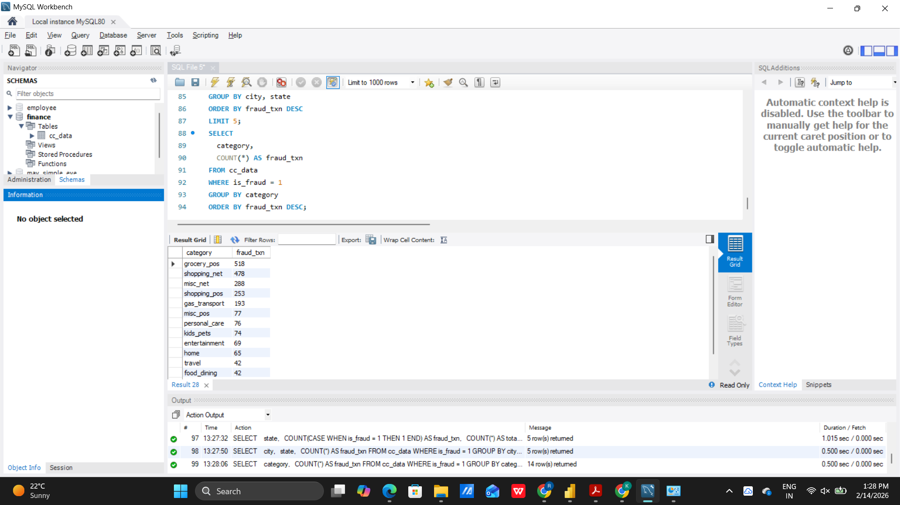
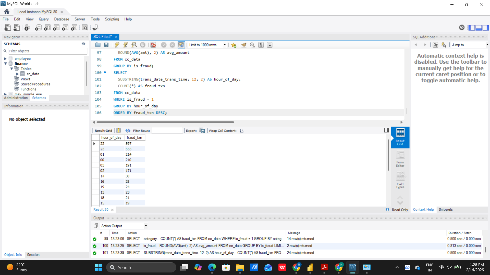
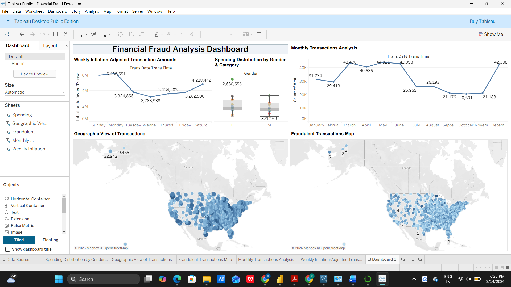

# 💳 Financial Fraud Detection: Anomaly Detection in Credit Card Transactions

End-to-end data analytics project on **389,197 credit-card transactions** using **Excel, MySQL, Python (EDA) and Tableau** to find where, when and how card fraud happens.

## Problem
SecureGuard Financial Solutions needs data-driven insight to spot fraudulent card transactions: which states/cities, categories and hours are riskiest, and how fraud amounts differ from normal ones. Full brief: [`docs/Problem_Statement.pdf`](Problem_Statement.pdf).

## Tech stack
| Tool | Used for |
|---|---|
| Excel | Descriptive stats, histogram, pivots, correlation |
| MySQL 8 (Workbench) | Storage, aggregation, fraud-rate analysis |
| Python (pandas, seaborn, scikit-learn) | EDA, outliers, Isolation Forest baseline |
| Tableau Public | Maps, time series, dashboard |

## Dataset
`cc_data.csv` (transactions) and `location_data.csv` (city, state, lat, long, city_pop). Target: `is_fraud` (1 = fraud). Files are not committed (large); put them in `data/`.

## Key findings (from the SQL queries)
- **Fraud is rare but costly:** 2,254 of 389,197 transactions are fraud (**≈0.58%**).
- **Fraud amounts are ~7.6× larger:** average **$518.48** vs **$67.83** for legitimate transactions.
- **Night-time risk:** hours 22:00–03:00 hold **1,936 of 2,254 frauds (≈86%)**; 22h and 23h alone have 597 and 553.
- **Risky categories:** `grocery_pos` (518), `shopping_net` (478), `misc_net` (288), `shopping_pos` (253), `gas_transport` (193).
- **States by fraud volume:** NY (162), TX (135), PA (133), OH (101), CA (90), which largely tracks transaction volume (TX, NY, PA, CA, OH).
- **States by fraud rate** (>1,000 txns): NV 0.95%, OR 0.88%, NE 0.86%, ME 0.83%, SD 0.79%.
- **Top fraud cities:** Houston TX (13), Naples FL (12), West Palm Beach FL, Topeka KS, Hovland MN (9 each).

| Fraud by category | Fraud by hour |
|---|---|
|  |  |

## Tableau dashboard


More sheets: [fraud map](01_fraud_map.png), [monthly transactions](02_monthly_transactions.png), [weekly inflation-adjusted amounts](03_weekly_inflation_adjusted.png).

## EDA summary (Python)
`amt` and `city_pop` are right-skewed; amt vs city_pop correlation is weak; the target is heavily imbalanced; fraud transactions have a higher median and wider spread of amount; IQR outliers exist in both numeric columns; no major data-entry errors. Full report: [`docs/EDA_Report.docx`](EDA_Report.docx).

## Business recommendations
1. Extra monitoring in high-fraud-rate states and cities.
2. Step-up authentication for risky categories (grocery_pos, shopping_net, misc_net).
3. Tighter alerts for 22:00–03:00 and for unusually high amounts.
4. Combine geography, category, amount and time into a fraud risk score.
5. Live fraud-KPI dashboard for the fraud team.

Full write-up: [`docs/Project_Writeup.docx`](Project_Writeup.docx).

## Repo structure
```
├── data/        # put CSVs here (git-ignored)
├── sql/fraud_analysis.sql
├── python/eda_and_model.py
├── excel/excel_steps.md
├── images/      # SQL result and Tableau screenshots
├── docs/        # problem statement, EDA report, write-up
└── requirements.txt
```

## How to run
```bash
pip install -r requirements.txt
python python/eda_and_model.py        # needs data/cc_data.csv
```
SQL: open `sql/fraud_analysis.sql` in MySQL Workbench after importing the CSVs into schema `finance`.

## Future scope
Supervised models (XGBoost / random forest with class balancing), per-customer behaviour features, real-time dashboards, external signals (device, IP).
